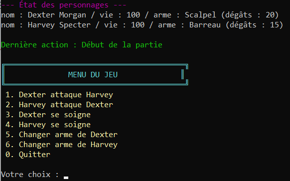

# Game C# Learning Exercises

## 🇫🇷 Présentation

Bienvenue sur mon projet **Game C# Learning Exercises**.  
Je m'appelle Ryan, étudiant en IT à la Haute École de la Ville de Liège (HEL).  
Ce projet a pour objectif de m'entraîner et d'apprendre les principes fondamentaux du langage C# à travers la création d'un mini-jeu.

### Objectif du projet

Le but est de développer un mini-jeu où des personnages peuvent :
- Changer d'armes
- S'attaquer les uns les autres
- Se soigner
- Interagir avec différents objets et mécanismes du jeu

Ce projet me permet de mettre en pratique la programmation orientée objet (POO), la gestion des classes, des méthodes, des interactions et des collections en C# (.NET 8, C# 12.0).

### Structure du projet

- `Arme.cs` : Classe représentant une arme (nom, dégâts)
- `Personnage.cs` : Classe pour les personnages du jeu (nom, points de vie, arme équipée, méthodes d'attaque et de soin)
- D'autres fichiers pour gérer les interactions, l'inventaire, et la logique du jeu

### Installation

1. Cloner le dépôt :
2. Ouvrir le projet avec Visual Studio 2022
3. Vérifier que le SDK .NET 8 est installé

### Utilisation

- Compiler et exécuter le projet pour tester les fonctionnalités du mini-jeu
- Modifier ou ajouter des classes pour approfondir la compréhension du C# et enrichir le jeu

---

## 🇬🇧 Presentation

Welcome to my **Game C# Learning Exercises** project. 
My name is Ryan, an IT student at HEL (Haute École de la Ville de Liège).  
This project aims to help me practice and learn the fundamental principles of C# by creating a mini-game.

### Project Goals

The goal is to develop a mini-game where characters can:
- Change weapons
- Attack each other
- Heal themselves
- Interact with various objects and game mechanisms

This project allows me to practice object-oriented programming (OOP), class and method management, interactions, and collections in C# (.NET 8, C# 12.0).

### Project Structure

- `Arme.cs`: Class representing a weapon (name, damage)
- `Personnage.cs`: Class for game characters (name, health points, equipped weapon, attack and heal methods)
- Other files to manage interactions, inventory, and game logic

### Installation

1. Clone the repository:
2. Open the project with Visual Studio 2022
3. Make sure .NET 8 SDK is installed

### Usage

- Build and run the project to test the mini-game features
- Modify or add classes to deepen your understanding of C# and enrich the game

---

## 📚 Licence

Ce projet est destiné à l'apprentissage et n'a pas de licence spécifique.  
This project is for learning purposes and does not have a specific license.
